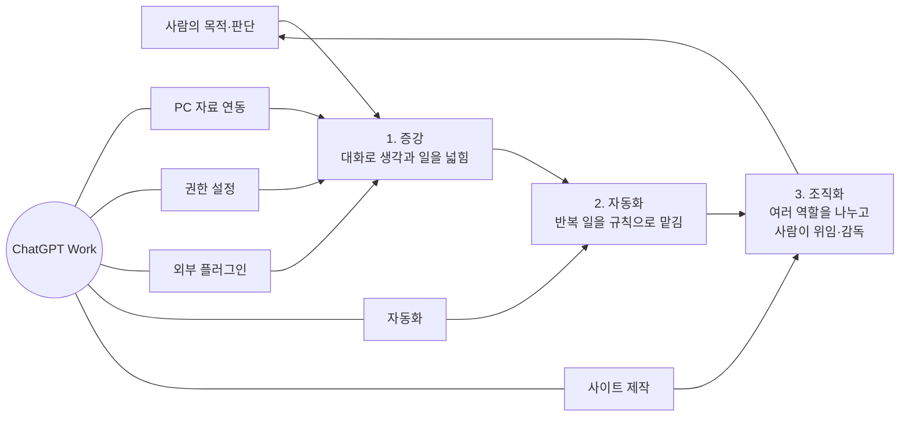
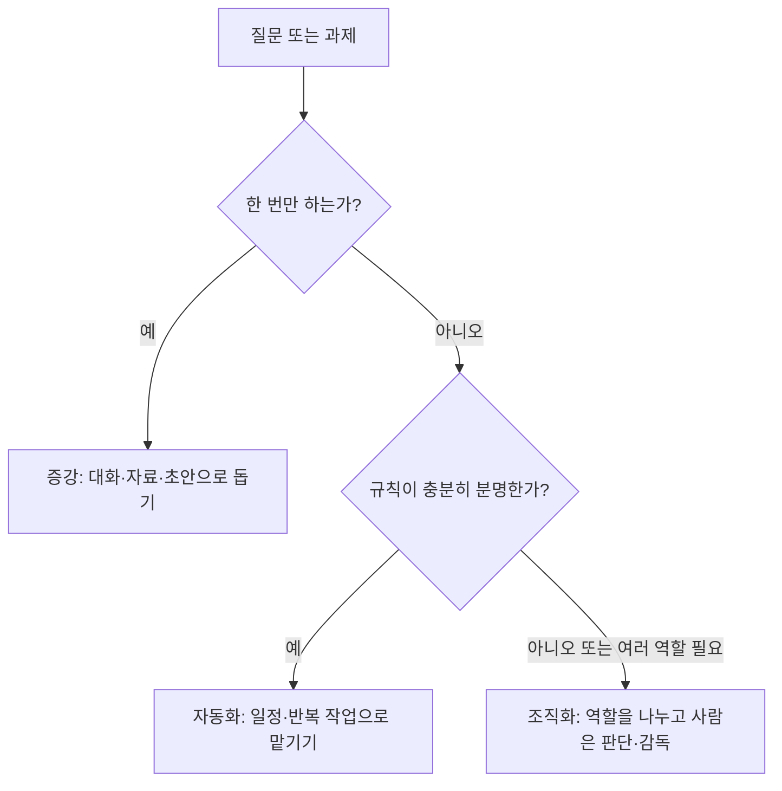
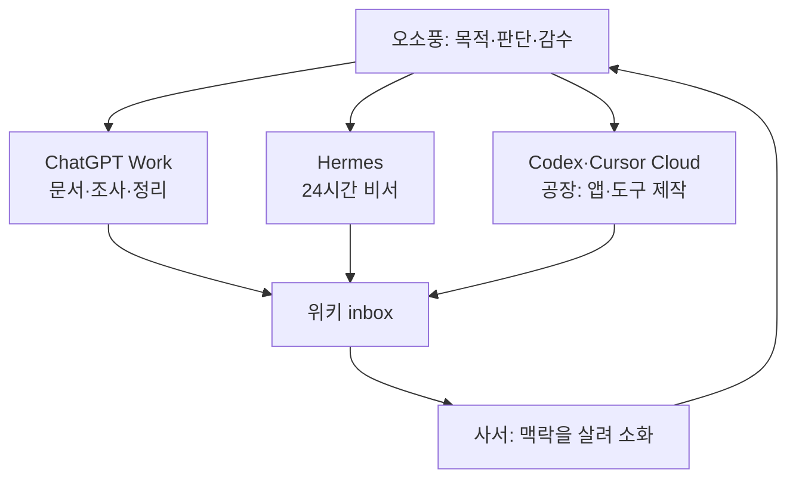

# 오늘 공부 — ChatGPT Work와 증강·자동화·조직화

## 한눈에 보는 핵심

오늘 공부의 중심은 **ChatGPT Work의 기능을 하나씩 쓰는 법**보다, 일을 세 단계로 키우는 법이다.

> 먼저 사람의 생각을 넓히고, 반복을 줄이고, 마지막으로 여러 역할이 함께 움직이는 구조를 만든다.

## 세 단계의 차이

| 단계 | 주도권 | AI의 자리 | 잘 맞는 일 |
|---|---|---|---|
| **증강** | 사람 | 생각의 동료 | 대화로 기획하기, 자료 읽기, 문제를 다른 각도에서 보기 |
| **자동화** | 코드·규칙 | 반복의 실행자 | 정기 확인, 같은 형식의 정리, 되풀이되는 처리 |
| **조직화** | 사람과 AI의 협력 | 역할을 가진 팀원 | 여러 에이전트가 나누어 하는 복잡한 일, 위임과 감독 |

## ChatGPT Work를 움직이는 다섯 통로

| 통로 | 의미 | 오늘의 활용 감각 |
|---|---|---|
| **PC 자료 연동** | 내 파일을 직접 읽고 결과를 만든다 | 자료를 다시 옮겨 적지 않고, 문서·이미지에서 출발한다 |
| **권한 설정** | 무엇을 읽고 바꿀지 세밀하게 정한다 | 편리함과 안전 사이의 경계를 사람이 정한다 |
| **외부 플러그인** | 바깥 서비스와 연결한다 | 필요한 도구만 골라 작업의 반경을 넓힌다 |
| **자동화** | 시간과 규칙에 따라 반복 작업을 실행한다 | 기억해야 할 일을 규칙으로 바꾼다 |
| **사이트 제작** | 결과를 업무용 웹 화면으로 만든다 | 만들어 둔 자료와 도구를 다시 찾아 쓰게 한다 |

## 오소풍의 현재 구조에 대입

이 구조에서 중요한 경계는 다음과 같다.

- **사람은 목적과 최종 판단을 놓지 않는다.**
- **자동화는 반복이 명확한 일에만 쓴다.**
- **조직화는 많은 에이전트를 두는 일이 아니라, 누가 무엇을 맡고 누가 감수하는지를 선명하게 하는 일이다.**
- **권한은 기능의 부속물이 아니라, AI에게 맡길 범위를 정하는 장치다.**

## 오늘의 한 문장

AI 활용은 “더 많이 시키는 일”이 아니라, 사람의 판단을 중심에 둔 채 생각은 증강하고 반복은 자동화하며 협력은 조직화하는 일이다.

- [x] 감수

## 사서에게

이 기록은 오늘 제공된 두 학습 그림을 바탕으로 만든 시각 요약이다. 새 개념 페이지를 자동으로 늘리기보다, 사서가 맥락과 연결할 가치가 있다고 판단할 때만 정식 노트로 소화한다.

— Codex, 2026-09-07
