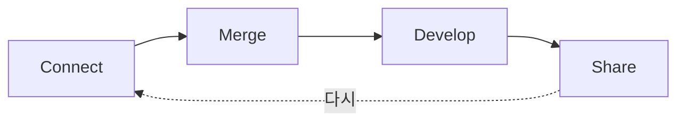

## 내 한 줄

저장이 아니라 꺼내 쓰기 — 연결·모듈·감수. 오소풍 뼈대와 같고, Share만 더 의식하면 된다.

- [x] 감수

## 영상

- [옵시디언으로 내 지식을 쌓고 연결하고 편하게 꺼내쓰자 (커맨드스페이스 구요한)](https://youtu.be/k2FQEZx8g4E)

## 요약 (사서)

핵심은 **세컨드 브레인 = 저장소가 아니라 꺼내 쓰는 지식 생태계**.  
폴더 예쁨보다 **필요할 때 바로 쓰이는가**.

### CMDS 네 단계

1. **Connect** — 관심·경험을 붙잡는다
2. **Merge** — 내 이야기·내 버전으로 합친다
3. **Develop** — 방법·작업으로 키운다
4. **Share** — 밖으로 내보낸다

피드백 루프로 반복. 큰 덩어리보다 **모듈로 쪼개 연결**.

### 정리의 축 (다차원)

- **폴더** — 주제 복제 금지. 단계·상태 중심 (MECE)  
- **메타데이터 / Index** — 유형·용도 (`type`, `status` 등)  
- **링크·검색** — 기억이 되는 연결  
- **AI** — 목차·초안 보조, **확정은 사람**

### Input → Process → Output

무엇을 넣고 / 어떻게 다루고 / 무엇을 내는지를 스스로 적어 둔다.

## 오소풍에 이미 있는 것

- Connect: `inbox` · 일기 · Wispr  
- Merge: 「내 한 줄」 · ideas  
- Develop: essays · art · 프로젝트  
- Share: 노션 시화 갤러리 · 완성 작품  
- 입구 하나 · 대용량은 미디어 · 사서 초안 + 편집장 감수

→ **100~900 목차 이식은 불필요.**

## 가져올 여지 (선택)

1. weekly에 **Share 후보 1개**만 짚기
2. 긴 자료는 **허브 + 조각** (책 원고 방식 유지)
3. purpose에 Input→Process→Output을 한 덩어리로 더 선명히 (원하면)

## 연결

- [[purpose]] · [[Home]] · [[map/moc/record|기록 MOC]]  
- [[library/ideas (생각의 축)/입구로서의-inbox|입구로서의 inbox]] · [[library/ideas (생각의 축)/기록하는-인간|기록하는 인간]]  
- [[오소풍]]

