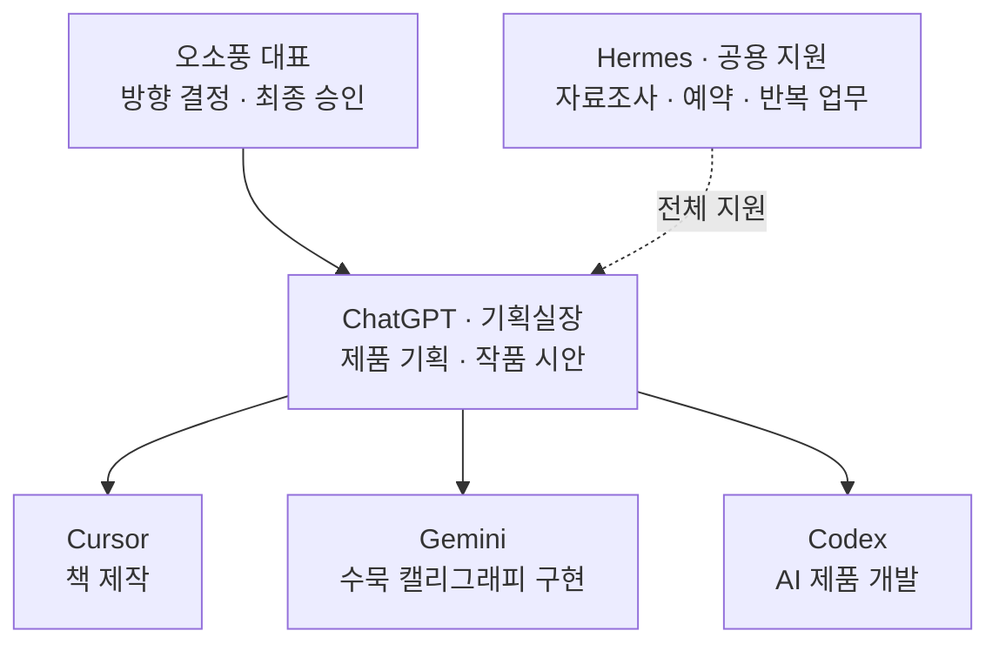
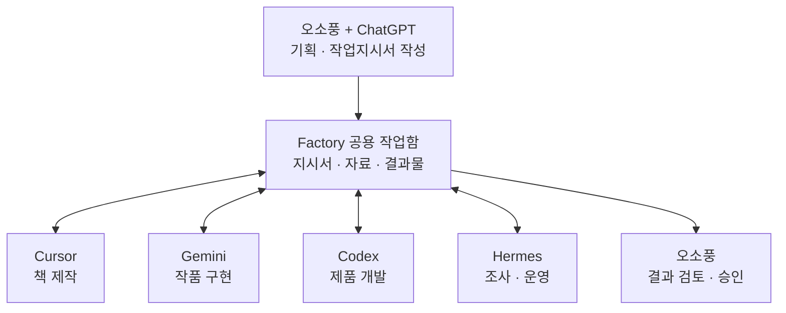

# 조직도

원본 mermaid. 호칭은 장부에서 **오소풍**(대표). 그림에 적힌 김종호는 같은 사람.

## 내 한 줄

대표가 정하고, 기획실장이 지시하며, 세 제작실이 만들고, 헤르메스가 받친다.

- [x] 감수

## 조직

## 작업 흐름

사서(맥 Cursor)는 이 그림에 없다.

## 연결

- [[오소풍 AI Studio/01-기준/회사창립기획서]] · [[오소풍 AI Studio/_index]]
